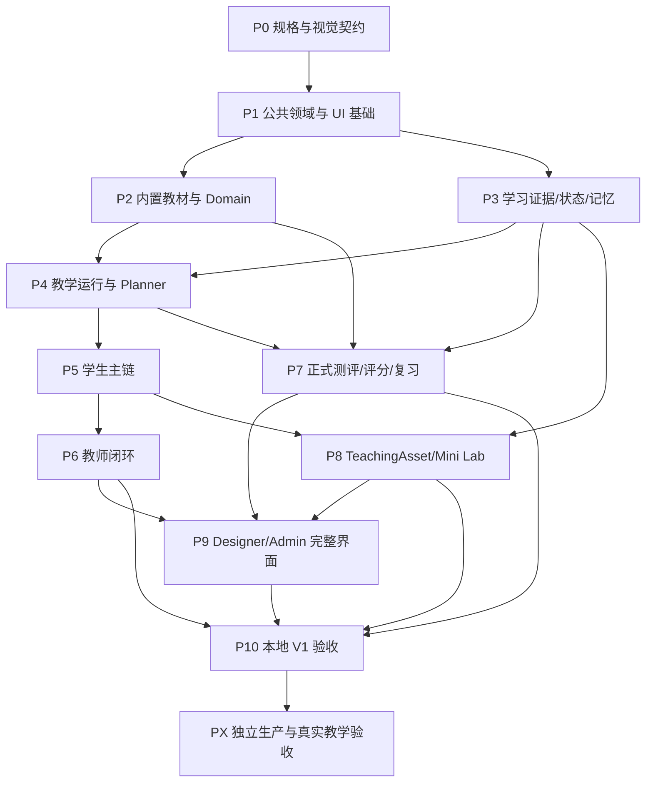

# 实验心理学智能学习平台 V1 详细执行计划与迁移路线

> 编制日期：2026-10-02  
> 对照代码：2026-10-02 工作区现状  
> 执行状态：已获用户授权实施。P0 设计交付包、P1 权限/Outbox/班级/Release 基础、P2 Domain Pack/ExperimentSchema 合同与持久 EvidencePointer/PDF 页图 Reader 首切片、P3 事件/Qualification/证据维度与掌握门槛及可恢复隐私删除工作单、P4/P5 可恢复学习任务/案例草稿与成长投影、P6 干预和 TeacherObservation 独立再验证、P7 截止锁/尾端恢复/人工评分/考试期隔离/错题追踪与质量反馈、P8 TeachingAsset/Mini Lab 检查点恢复、P9 管理员首批治理切片已落地；最新迁移头为 `0045`。0042—0045 提供持久删除回执、预先生成的状态凭证、异步可重派发工作单和明确保留类别；0045 集成后隔离全量后端回归 **275 passed**（3 条依赖/pytest cache 警告），P3-06 专项 **9/9**；前端 Node **32/32**、TypeScript、lint 通过。OpenAPI 路径数为 127，含 PDF 页图 Reader、案例草稿字段和隐私删除重试。Reader 仅覆盖现有 PDF 固定页图；DOCX 固定渲染、完整教材构建/定位、完整管理员 IAM 等仍未完成。真实 TCP/Worker/Redis 故障恢复也未完整验收。Web/API 3000/8000 保持运行，连接隔离开发数据库；预览库仍是 Alembic 0044。V1 尚未整体验收，逐项状态以 `docs/v1/implementation-status.md` 和 `docs/v1/acceptance-report.md` 为准。
> 状态边界：本文仍是实施路线和验收基线；每个任务的代码、测试、环境和真实数据验证状态以 `docs/v1/implementation-status.md` 为准。

## 1. 阅读说明与依据

### 1.1 两份设计基线

本计划直接依据用户提供的两份文档，不以历史上传方案或旧 README 推断目标：

| 标记 | 文件 | 文档内版本/日期 | 用途 |
| --- | --- | --- | --- |
| G | 实验心理学智能学习平台-总体设计文档-V1.md | V1.0 / 2026-10-01 | 产品范围、领域模型、教学逻辑、后端、版本、权限、评测 |
| F | 实验心理学智能学习平台-Frontend-Specification-V1-1.md | 文档标题及版本仍为 V1 / V1.0 / 2026-10-01 | 四工作区、页面、交互、组件、视觉、响应式 |

源文件均位于用户提供的微信文件目录，保持原文件不变。文件名中的“V1-1”不自动视为内容已升级至 V1.1。

原始文件 SHA-256：

- G：`19D108A6FF83E32D2CE7AA57CC13996BC7DB20B754B70F4C00D43046AEE00891`。
- F：`C920AC73625B80F4C4E6016C3B347155E9629FFADF399DC3AF9561C2E632B805`。

来源章节在本计划中写成“G §17—22”“F §9.2”等。G 第二十一部分合并了前端规范，本计划的 G 编号默认引用其前二十部分及 §87—88。

### 1.2 本计划与实施授权

本文件最初用于执行前计划；当前已进入实施批次。已发生的代码、迁移、依赖安装和验证以 `docs/v1/implementation-status.md`、代码与测试结果为准；仍未执行外部模型调用、提交或推送。

本计划初稿的仓库核对属于静态检查；后续实际运行的业务测试和环境验证以 `docs/v1/implementation-status.md`、`docs/v1/acceptance-report.md` 的最新记录为准。各任务开始时仍须读取完整受影响实现和测试。

### 1.3 范围协调与待审阅决策

| 编号 | 差异/不确定项 | 本计划建议 | 决策时点 |
| --- | --- | --- | --- |
| R01 | 旧项目说明仍以教师上传为主，新设计取消该产品流程 | 目标采用内置教材；工程解析/存储/索引底座逐步复用；权限和入口按阶段收口 | 批准总体计划时 |
| R02 | G 开发顺序先后端基础，F 先 Foundation/视觉 | 先冻结规格与高保真，再同步推进基础组件；业务前端依赖真实契约与后端能力 | 批准总体计划时 |
| R03 | G 把监控、备份恢复列入最终完成定义；此前明确不做 D41—D50 | 本地 V1 为当前执行批次；生产监控、备份恢复、容量验证与真实班级验收单列未来阶段，不阻塞本地里程碑；完整 G 交付仍需这些验收 | 审阅第 13 节时 |
| R04 | G 与 F 的 AI 禁用枚举、知识状态大小写不同 | API 使用统一规范值；前端只做显示映射；旧值通过适配迁移，禁止直接改含义 | P0 契约冻结 |
| R05 | F 的 UI Policy 层级和 G §52 的安全优先级表达不同 | G §52 决定权限上限；UI 层级只解释配置来源，底层配置只能进一步收紧硬限制 | P0 契约冻结 |
| R06 | 正式测评进行中限制其他课程/历史会话的范围未完全定义 | 保留现有禁用防线；明确同账号多标签页及跨入口策略后再收敛，不默默放宽 | P0、P7 |
| R07 | 没有确认最终 DOCX、正式题库、Mini Lab 内容或供应商授权 | 工程先用自编、可授权的小型 fixture 验证；真实教材和真实模型验收分别设输入门槛 | P2、P7、P8 |
| R08 | 人员数量、期限未指定 | 使用依赖和验收驱动批次，不承诺日历工期；实施前按任务估算与可投入人员排期 | 首批启动前 |

推荐采用“渐进领域迁移 + 逐条业务闭环”。一次性重写风险大；只换页面则不能满足 Release、Qualification、Policy 和教师干预要求。本文选择复用已验证底座、增加新领域边界、兼容旧数据与历史引用的路线。

## 2. 目标范围和完成层级

### 2.1 必须落实的产品决策

1. 内置单一权威 Word 教材，经离线 Course Compiler 生成固定 PDF、页面、对象与索引。
2. Student / Teacher / Course Designer / Admin 四工作区；Designer 和 Publisher 权限分离。
3. Student 一级导航为学习、实训、成长、我的；Teacher 为总览、教学、学情、测评、课程。
4. 教学主界面使用有限任务和 Learning Stream；Evidence、Branch、Task Detail 共用单一 Context Panel。
5. 原始事件、合格学习证据、Student Model、Memory 分层，不由模型直接写状态。
6. Mastery 依赖多次、不同情境、至少一次独立且包含较高层表现的证据；Review 到期与 Mastery 分开。
7. 教师以可解释 Attention、诊断、Timeline、Intervention、再验证形成闭环。
8. 正式测评独立 Shell，版本冻结、后端 AI Policy、服务端计时、自动保存、幂等提交、人工主观评分。
9. TeachingAsset 白名单与可降级 Contract；Mini Lab 区分实验数据和学习证据。
10. Domain / Pedagogy / Assessment 独立发布，由 CourseRelease 固定组合；运行中任务绑定旧版本。
11. 权限、不可变证据、拒答、审计、错误恢复和核心 E2E 按批次持续验收。

### 2.2 不进入首期的扩展

通用教材上传产品、自治 Agent Swarm、任意运行时 React/HTML/JS、学生排名/风险榜、私聊监控、摄像头监考、眼动/生理采集、通用低代码/BPMN、默认知识网络图、Teacher Prompt/Token/Temperature 面板不纳入 V1。

OCR、复杂表格恢复、视觉 Embedding、ColPali/ColQwen、多向量检索、BKT/IRT、高级统计和自动稳定偏好推断属于有评测收益后才讨论的候选，不作为当前完成门槛。

### 2.3 交付必须分层描述

| 层级 | 判定依据 |
| --- | --- |
| L1 已编码 | 实现、迁移、契约、前端消费者和文档一致 |
| L2 自动测试通过 | 对应单元、权限、状态机、集成、契约测试有实际结果 |
| L3 本地环境验证通过 | PostgreSQL/Redis/MinIO/Worker/Web 联调、关键恢复及浏览器路径通过 |
| L4 真实教材/模型验证通过 | 最终教材人工金标、引用定位、拒答及已授权供应商联调 |
| L5 生产运行验证通过 | 部署、监控、备份恢复、容量等独立验收 |
| L6 真实教学效果验证通过 | 真实班级的即时/迁移/延迟保持等研究设计与数据支持 |

本地 fixture 和 Synthetic Student 只能支持 L2/L3 及路径覆盖，不支持 L4 的真实教材结论或 L6 的学习效果结论。

## 3. 当前仓库核对与复用边界

### 3.1 静态核对结果

| 领域 | 当前代码证据 | 对 V1 的判断 | 处理 |
| --- | --- | --- | --- |
| 身份/会话 | `server/app/modules/auth/`、`test_auth_flow.py` | 可复用 Cookie、登录、刷新基础 | 扩展 Role + Scope 和会话撤销验收 |
| 课程权限 | `auth/dependencies.py::require_course_role` 对平台管理员直接返回 teacher | 与 G §56 “管理员不自动继承教学权限”有明确差异 | P1 先修正权限模型及所有消费者 |
| 课程/成员 | `Course`、`CourseMember`；角色 teacher/student/assistant | 当前成员围绕 Course；未见独立 Class/多角色授权模型 | 新增 Class、RoleAssignment 与迁移映射 |
| 前端工作区 | `WorkspaceRoleGuard.tsx` 固定 admin > teacher > student | 已有守卫；不支持 Designer 或多角色工作区选择 | 迁移为服务端可用工作区/Scope |
| 教师导航 | `CourseShell.tsx` 含教材、题库、测验、成员、处理进度 | 与五项目标导航、无上传目标不同 | 合并到目标入口；历史入口兼容 |
| 学生页面 | 已有 learn/practice/growth/me 课程路由 | Practice 仍混合测验；Growth 已改为知识状态、证据数量、关注项与下一步行动投影 | 拆独立正式测评，继续补齐知识/技能/误区/轨迹四 Tab |
| 前端依赖 | `web/package.json` 只有 Next/React/Iconify 等 | Tailwind、shadcn primitives、jsPsych、浏览器 E2E 尚无对应依赖 | 各批次评估后有目的接入，不预先批量安装 |
| 原生 PDF | `0014_verifiable_pdf_pages.py`、`stub_pdf.py`、artifact 测试 | 比旧 AGENTS 的 0013/仅段落描述更新；已有原生图、简单网格表/保守公式处理代码 | 保留、抽检，不宣称 OCR/复杂表格/视觉检索完成 |
| DOCX/快照 | OOXML parser；`renderers/base.py` 的 `DocumentRenderer` Protocol | 接口已有；不能把 Protocol 等同于已运行的 DOCX 固定渲染器 | P2 落地渲染器、对象对齐和真实页定位 |
| RAG | `knowledge/`、Query/Fusion/Context/Evaluation、对应测试 | 文本混合、权限过滤、父子上下文等可复用 | 接入 CourseRelease/不可变 Evidence Pointer 和严格支持校验 |
| 教学运行 | `LearningSession`、`tutor/service.py`、SSE | 有状态/提示基础；未见目标 CurrentLearningTask 完整模型 | 有限任务、动作空间、Policy、Episode 渐进接管 |
| 学习证据 | `LearningEvidence` 绑定题目，source 限 formal_quiz/practice/review | 来源和数据结构不足以覆盖 Tutor/Case/Lab/Observation | 新增原始事件、Qualification、多维目标及幂等链 |
| 掌握与记忆 | `MasteryState`、`memory/service.py` | Mastery 位于 memory 服务；规则主要为数量、加权正确率 | 分离 Learner Model，记录算法版本、证据维度/独立性 |
| 隐私删除 | `memory/router.py::request_data_deletion` 事务删除个人上下文、停用去标识账号并生成持久回执；0044 增加 30 天无登录状态核验凭证 | 答卷/成绩、审计和课程任课资产仍需机构保留规则；外部备份/生产索引擦除未验证 | 完成异步任务编排与机构策略定义，再做备份/生产索引擦除验收 |
| 题库/测验 | `QuestionVersion`、`AssessmentItem`、`AttemptAnswer` | 版本和答案乐观锁可复用；Rubric 目前为文本字段，AI Policy 旧枚举 | 补独立 RubricVersion、AssessmentRelease、评分三对象 |
| Branch | `test_question_agent_branches.py` | 已有隔离与确认合并测试；再次 merge 返回 409 | 明确相同幂等键回放，重复命令不制造副作用 |
| 教师学情 | `analytics/router.py` 为课程聚合 | 聚合可复用；尚无目标班级问题/活动/干预对象 | Class scoped Read Model、必要证据下钻 |
| Outbox | `contracts/events/README.md` 有约定；模型/核心目录未见实现 | 文档约定不能算已实现 | 业务事务+Outbox+消费去重实际落地 |
| Release/Designer/Lab | 模型和路由检索未见目标完整对象 | 按新增领域能力规划，任务开始前复核同义实现 | Release 底层先行，authoring UI 后置 |
| Admin | 健康、审计入口已存在 | 可复用运行基础；IAM、Class、版本完整管理缺口 | P1/P9 补齐；不读取教学隐私 |

以上“未见”指本轮指定目录静态核对结果，不等于对仓库所有历史实现做过完整审计。

### 3.2 本轮需保护的已有工作

工作区已有四项未跟踪内容：RAG benchmark 文档、2026-09-27 前端重设计方案、`web/CLAUDE.md`、根教材上传优化方案。本计划不修改、不删除、不自动纳入提交；实施前再次核对 `git status`。

旧教材、题目版本、原始作答、证据与历史引用全部保留。历史迁移 `0001—0014` 不修改；后续版本号在实施时按实际 head 分配，避免提前写死迁移编号。

## 4. 总体顺序、依赖与组织方式

### 4.1 统一阶段

| 阶段 | 名称 | 来源映射 | 核心退出条件 |
| --- | --- | --- | --- |
| P0 | 设计、契约、迁移规格冻结 | G Phase 0；F 高保真/Component/API | 目标对象、状态、页面规格和兼容方案可实施 |
| P1 | 权限/班级/事件/Release 与 UI 基础 | G 公共边界；F Phase 0 | 无管理员继承教学权限；基础壳和事务链可用 |
| P2 | 内置教材、Domain、证据定位 | G Phase 1 | 固定教材版本可构建、可发布、可引用 |
| P3 | Learning Record、Learner Model、Memory | G Phase 2 | 合格证据驱动可解释状态，隐私请求真实执行 |
| P4 | Teaching Runtime 与 Planner | G Phase 3、§30—33 | 有限教学任务可暂停恢复、符合 Policy |
| P5 | 学生主链与实验推理 | G Phase 4；F Phase 1 | Home→Learn→Evidence/Branch→Practice→Growth |
| P6 | 教师诊断、Timeline 与干预 | G Phase 5；F Phase 2 | 问题→证据→活动→干预→再验证 |
| P7 | 题库、正式测评、评分与复习 | G Phase 6；F Phase 3 | 版本、计时、AI 限制、保存提交和人工评分完整 |
| P8 | TeachingAsset 与 Mini Lab | G Phase 7；F Phase 4 | 白名单组件和 2—3 个教材支持实验形成合格学习证据 |
| P9 | Course Designer 和 Admin 完整工作区 | G Phase 8/部分 9；F Phase 5/6 | 编辑/发布分权、Diff/Gate、IAM/任务/审计完整 |
| P10 | 本地 V1 集成与最终评测 | G §67—71、§84—86；F §29 | 跨角色闭环、硬零测试、缺口清单和交付报告 |
| PX | 生产运行与真实教学验证 | G Phase 9/最终完成；旧 D41—D50 | 独立批准后执行，不混入本地完成声明 |

P0 的高保真为批准后的任务，本轮不生成视觉稿、不创建样例应用。P9 是完整作者界面的交付阶段；Release/Designer 权限/最小构建发布能力在 P1/P2 提前建立，避免课程运行依赖尚未出现的发布底座。

### 4.2 依赖关系



P3 数据框架可在 P2 构建期同步设计，但真实知识点绑定及实数据验收依赖 P2。P7 的规格/题库资产部分可以提前，正式 Shell 联调和 LearningEvidence 消费须满足图中依赖。

### 4.3 任务粒度与状态

任务编号 `P阶段-序号` 固定，用于提交、测试报告和交接。执行状态使用：未开始、进行中、待验收、已验收、阻塞、延期。已落地任务的实际状态以 `docs/v1/implementation-status.md` 为准，其余任务仍按未开始处理。

工作量只作粗估：S=约 0.5—1 人日，M=约 1—3 人日，L=约 3—5 人日；包含该任务局部测试与文档，不含内容审核/等待/跨阶段返工。L 任务启动前拆为可审查小批次。没有人员和质量基线前不据此承诺总工期。当前实施在满足依赖的前提下允许独立任务并行，状态以实施状态记录为准。

每个任务由一位端到端负责人交付，权限、迁移、正式评分、发布由另一位有权限的审核者复核。窗口所有权、启动条件和交付边界见 `docs/v1/V1并行实施分工-2026-10-04.md`；该分工文档不表示其他窗口已启动。

### 4.4 主窗口的并行协调流程（2026-10-04 增补）

1. **固定共同基线**：主窗口先完成当前编辑和验证，记录实际迁移 head、OpenAPI 路径数、后端/前端测试结果、`git status`、运行中的预览进程与数据库。当前大量 V1 改动尚未提交，不能让新 worktree 直接从旧 `HEAD` 开工；共同基线必须包含这些改动。
2. **发布文件所有权**：主窗口按并行分工文档划定 A（教材 Reader）、B（测评/故障恢复）、C（管理员治理）、D（教学资产/Mini Lab）的排他文件与独立测试库。收到所有权确认前，其他窗口只进行只读调研。主窗口在窗口交付期间不编辑其排他文件；`models.py`、Alembic、OpenAPI、测试公共 fixture 和总验收文档仍由主窗口统一处理。
3. **并行推进与主窗口自身工作**：A/B/C 在基线和文件所有权确认后处理各自未完成任务；D 受最终教材来源条件约束。主窗口继续处理未分配的跨模块契约、P3/P4/P5 剩余工作、共享迁移与回归，不等待所有窗口结束才开展独立工作。需要修改共同文件时，由主窗口安排独占时段或统一集成。
4. **完成即集成**：各窗口提交实际改动文件、定向测试、浏览器/故障证据及剩余边界后，主窗口及时接收并验证；按风险同步模型、迁移、OpenAPI、前端消费者和状态文档。窗口之间不共用会截表的测试数据库，也不重启主窗口的 3000/8000 预览。
5. **统一退出门槛**：所有并行结果集成后，主窗口运行 Alembic upgrade/check、完整后端回归、前端 test/typecheck/lint 和受影响的浏览器关键路径，并按 L1—L6 层级更新验收报告。局部窗口通过不能替代总体 V1 验收。

## 5. 逐阶段详细任务

### P0：规格、契约与视觉冻结

输入：G/F、当前代码与契约、现有测试；不依赖最终教材内容即可开始。输出先供用户审核，审批通过后再进入 P1。

| 编号/量级 | 执行内容 | 明确产物 | 验收 |
| --- | --- | --- | --- |
| P0-01 / M | 建需求追踪矩阵；每条标注设计章节、现状、目标差异、责任领域、任务和测试 | `docs/v1/requirements-traceability.md` | 七方向、四工作区、全部硬约束都有任务去向 |
| P0-02 / L | 拆后端领域规格：所有权、聚合、服务调用、事务、版本、Class/RoleScope、Release 关系 | `docs/v1/backend-domain-spec.md` 与 ER/依赖图 | 原始事件/证据/推断/记忆分离；无循环直接写表 |
| P0-03 / L | 冻结 API 与状态机；定义 Command/ReadModel、错误、幂等、409、SSE 和投影新鲜度 | `docs/v1/api-state-contract-spec.md`、状态转移表和 JSON 样例 | 每种状态有允许动作、权限、副作用、非法路径 |
| P0-04 / L | 按 F §27 完成 11 组代表页高保真；每组含关键加载/空/失败/窄屏状态 | `docs/v1/visual/` 稿件、视觉审阅记录 | Student 5 秒/Teacher 30 秒目标转为可观察任务；用户确认视觉基准 |
| P0-05 / M | 制作组件 Contract：输入、动作、键盘、焦点、错误、响应式、遥测、fallback | `docs/v1/component-spec.md` | 九类 Learning Block、Evidence 家族、Drawer、Assessment/Lab Shell 有契约 |
| P0-06 / M | 盘点旧数据并设计映射、兼容窗口、feature flag、备份演练方案；解决 R01—R08 | `docs/v1/migration-plan.md`、决策记录 | 不假造历史快照/正式资格；运行中任务不静默换版 |

实施入口：P0 仅完善执行规格，不重写两份产品基线。API 草案放独立规格/样例；只有实现时由 FastAPI 导出 OpenAPI 快照，禁止手工改 `contracts/openapi.json`。

### P1：权限、公共模型与前端基础

依赖：P0 契约和视觉基准。相关现有位置：auth/courses、db/models、core、CourseShell/RoleGuard、globals.css、web/lib/api.ts。

| 编号/量级 | 执行内容 | 明确产物 | 验收 |
| --- | --- | --- | --- |
| P1-01 / L | 新增 RoleAssignment/ResourceScope；分 Student、Teacher、Designer、Publisher、Admin；替换管理员返回 teacher 的快捷逻辑 | 新迁移、授权 service、权限矩阵测试、/me capabilities | 无课程授权的 Admin 不能读教材/学情/私聊；Designer 不能发布；直接 API 访问受限 |
| P1-02 / L | 新增 Class、ClassMember、TeacherAssignment、CourseReleaseAssignment；兼容原 CourseMember | 班级 API、迁移 dry-run 报告、成员映射 | 同课程不同班级互不泄露；移除/调班即时改变权限；历史记录仍可追溯 |
| P1-03 / L | 落地 Outbox、消费去重、重试和投影水位；业务写入与事件同事务 | outbox 服务、consumer ledger、失败恢复测试 | 事务回滚不发业务事件；重复消费不重复记证据；崩溃后可续处理 |
| P1-04 / L | 建三类 Pack Release、CourseRelease、manifest、草稿/发布绑定和 LKG 基础 | release 模型/服务、最小 CLI/受控发布接口 | 发布对象不可改；失败构建不影响稳定版本；不能绑定跨课程资产 |
| P1-05 / L | 接入 Token 与 primitives：颜色、字体、间距、密度、焦点、Drawer/Sheet、Table、Wizard | `web/design-system/`、`web/components/ui/`、组件状态验证 | 断点与 reduced-motion 生效；每区一个主操作；触控目标约 44px |
| P1-06 / L | 建四 Shell、工作区选择/守卫、课程/班级上下文、独立 Assessment/Lab Shell 挂载方案 | 路由表、导航、共享 API 错误/request_id 处理 | 多角色只进入已授权工作区；Assessment 不继承普通导航；401 可恢复 |
| P1-07 / M | 冻结类型生成链、SSE transport、缓存 Scope、异步取消、Loading/Empty/Error 基础 | typed client、领域 query/key 规范、基础 E2E 工具 | 切换课程/学生后不显示旧缓存；Unknown Block 安全降级；禁止公网依赖单元测试 |

不把平台角色一对一转换成最高优先工作区。工作区可用性来自服务端授权；具体资源读写再次鉴权。已有 Cookie 与同源代理保留。

### P2：内置教材、Domain 和 Evidence

依赖：P1 授权/Release。真实内容门槛：最终 DOCX、许可、字体/渲染环境；缺少时可用自编 fixture 完成工程验证，不能完成真实教材验收。

| 编号/量级 | 执行内容 | 明确产物 | 验收 |
| --- | --- | --- | --- |
| P2-01 / L | 实现 Course Compiler manifest 与阶段任务；复用 MinIO/Job/Celery/checkpoint | 构建命令、任务记录、内容哈希和配置清单 | 相同构建可复现；中断/重试不制造重复版本；失败保留 LKG |
| P2-02 / L | 选择本地 DOCX 渲染器，固定字体/页面/版本，输出不可变 PDF 与 page images | renderer adapter、字体替换记录、页面尺寸/rotation/DPI/hash | 同配置页数/布局稳定；依赖缺失明确阻塞；页码不取 Word 逻辑页 |
| P2-03 / L | OOXML Canonical Object 与 PDF 页对象对齐；段落/图/表/公式/标题/跨页映射 | object/anchor 存储、人工抽检和坐标变换测试 | 无定位依据时标记不支持并阻止要求精确引用的发布；不得伪造 bbox |
| P2-04 / L | 建 KP、关系、ExperimentSchema、MisconceptionDefinition 与 EvidenceBinding | domain service、审核状态、最小 seed/CLI | 每条事实有教材绑定；未提供字段保持空；关键关系不由 AI 自动发布 |
| P2-05 / L | RetrievalUnit/Index 绑定 DomainRelease；保留 BM25/外部向量门槛、Weighted RRF/closure | 检索契约、固定语料评测和索引发布门禁 | 权限/版本在召回前过滤；hash-v1 不充语义向量；召回不足拒答 |
| P2-06 / L | 持久不可变 EvidencePackage/Pointer、Claim 支持四态、有界一次补检索 | evidence 服务、审计追踪、可恢复引用 API | 数值/方向/条件不支持须降级；旧版本引用正确；票据过期可重新鉴权恢复 |
| P2-07 / L | 只读 Reader、页跳转/bbox 高亮、Evidence 家族、教材替代入口 | Reader/ContextPanel、页面访问 API 与浏览器测试 | 点击引用打开生成时版本；撤权/撤回后拒绝；缩放/旋转高亮正确 |
| P2-08 / M | 退出普通教师上传产品；关闭旧路由和上传/解析/索引/教材发布权限，保留内部工程能力 | 导航迁移、legacy 路由说明、授权回归 | 隐藏按钮和直接 API 均受限；已有未完成任务有受控处理归属 |

固定渲染器和对象对齐必须单独验收：已有 DOCX parser 或 PDF bbox 并不自动解决 DOCX 对象与固定页定位。首次真实内容需覆盖标题、中文段落、跨页段落、图注、简单表、公式和字体替换；无关 OCR/视觉检索不加入本阶段。

### P3：Learning Record、Student Model 与 Memory

依赖：P1；真实 KP 和 Release 绑定依赖 P2。相关现有位置：LearningEvidence/MasteryState/MemoryItem、memory/service、assessment 提交路径。

| 编号/量级 | 执行内容 | 明确产物 | 验收 |
| --- | --- | --- | --- |
| P3-01 / L | 新增 LearningEvent、业务事件 source refs、Qualification、失效/替代关系 | record service、幂等键和验证规则 | 点击/停留不等于学习证据；来源绑定用户/任务/版本，客户端不能伪造评分与维度 |
| P3-02 / L | 支持 Recall/Understand/Discriminate/Apply/Transfer/Retention，hint_level/count、独立性、题目质量 | `LearningEvidence`、来源 adapter、迁移 `0028/0034` | 重复事件不增加 evidence_count；有提示答对不计独立证据；熟练/掌握还须跨2种情境；质量失效可重算 |
| P3-03 / L | 分离 learner_model；实现 Knowledge/Misconception/DomainSkill 状态与 explainability | 可解释规则、算法版本、证据引用和重放脚本 | 一次高分不 mastered；一次错误不 confirmed；不足证据区别薄弱；首版知识状态保存规则版本与理由，技能/误区模型仍待补齐 |
| P3-04 / M | 独立 ReviewState/窗口与延迟验证；到期不直接降 Mastery | ReviewTask 延迟验证、retention Qualification、状态投影 | “比较稳定+复习到期”同时表达；延期、重复验证和时区可核对 |
| P3-05 / L | Memory 改为任务连续性/已确认偏好；OBSERVED/INFERRED/EXPLICIT/TEACHER_CONFIRMED 与冲突动作 | memory contract、Episode 候选、旧数据映射 | 流式半回合无长期写入；未合并 Branch 不进入主线；跨课程检索禁止 |
| P3-06 / L | 学生反馈/教师异议为新记录；删除任务真实执行与重算、索引/cache 清理 | feedback、deletion job/status、审计与测试 | 隐藏不能返回删除完成；停用会话；删/匿名化范围可验证；历史保留依据单独说明 |

首次迁移保留旧证据原值及 legacy 来源，不按正确率把旧 `mastered` 无条件映射为新 mastered。只有支持必要维度、独立性和来源的证据才参与新算法；无法恢复的信息标明证据不足。合法删除优先于一般不可变保留，依法/按机构规则必须保留的成绩和审计需采用最小化独立策略，不保留私人记忆正文。

### P4：Teaching Runtime、Policy 与 Planner

依赖：P2/P3。复用现有 tutor/learning session 和模型适配器，不建立自治 Agent 微服务。

| 编号/量级 | 执行内容 | 明确产物 | 验收 |
| --- | --- | --- | --- |
| P4-01 / L | CurrentLearningTask、TeachingSession、UnifiedTeachingContext、Episode；固定目标/版本/完成条件 | 迁移 `0032/0033`、新旧运行时聚合 refs、任务读写 API、pause/resume/恢复 | 刷新恢复当前任务；一个回合一个动作；无学生响应不自动推进；旧目标未知时明确保留 unknown |
| P4-02 / L | Policy Engine 先确定 allowed actions 再调用模型；继承 System/Assessment/Teacher/Intervention/Preference | effective policy、决策理由、权限检查 | 学生偏好/模型输出不能解禁考试；跨入口调用规则一致；过期 Attempt 正确退出限制 |
| P4-03 / L | 固定 Teaching Action、诊断六态、support gradient、提示上限与 fading | action schema、transition table、确定性执行器 | hints 可追溯；错误支持补救→micro-check→重试；超过预算可结束/求助 |
| P4-04 / L | Structured TeachingTurnResponse 与九类 Block；先校验后确认输出，SSE 中断恢复 | stream 协议、turn 幂等、Block Registry 对接 | 半题目/半资产不渲染；未核验主张不显示为确定结论；重试不重复证据或记忆 |
| P4-05 / L | Branch 绑定对象/选区/回合；确认 structured merge，建立幂等回放 | branch service/contract、隔离测试 | 未确认不合并；同键重复返回原结果；不同合并请求有明确冲突 |
| P4-06 / L | Planner 从已发布结构候选选择，输出四态 Progress Decision；复习与前置图约束 | planner、决策解释、候选预算和 fallback | 不足证据不判失败；Planner 超时不阻断当前任务；正式测评只按已授权安排进入 |
| P4-07 / M | 区分课程概念讨论、教材引用与个人危机意图；个人危机时退出普通教学并呈现人工支持边界 | safety policy、语境回归样例、状态退出与恢复记录 | 讨论教材中的自伤/心理学术语不自动触发个人危机；个人危险意图不继续普通练习；不输出医疗诊断 |

模型负责受限选择与内容生成，确定性服务负责写状态、评分、发布与权限。上下文按 Policy→Task→Textbook Evidence→Recent Conversation→Relevant Memory 加载，预算和异常分别记录，不用完整 Prompt 做日志。

### P5：学生主链与实验推理

依赖：P4、P1 组件和 P2 Evidence；F §9/14—20。页面只消费专用 Read Model，复杂状态不长期仅保存在 Local State。

| 编号/量级 | 执行内容 | 明确产物 | 验收 |
| --- | --- | --- | --- |
| P5-01 / M | StudentHomeProjection 与首页：一个当前任务、≤2 下一步、≤1 关注项 | Home API/页面、空课程/无任务状态 | 5 秒内识别下一步；无全局 Chat、百分比/KPI |
| P5-02 / L | Learning Header/Task Bar/Rail/Stream/ContextPanel；问 Tutor 按需展开 | `components/learning/`、任务页、浏览器测试 | 面板一次一个上下文；打开证据不丢作答；移动端 Sheet 焦点与返回正确 |
| P5-03 / L | Practice recommendations；实验推理按能力组织；测评分离入口 | Practice Read Model/页面 | 推荐有真实来源；没有内容时显示缺口及可执行下一步，不摆静态假功能 |
| P5-04 / L | CaseSession 与 Experiment Decomposer/Find Confound/Design Board/Result Interpreter/Critique | case service、Reasoning Panel、案例作答与资格规则 | 点击选择+文字推理共同评分；鼠标/触控/键盘等价；支持 scaffold 递减 |
| P5-05 / L | Growth 四 Tab、知识/技能/误区/轨迹，为什么/反馈 Drawer | growth projection、可解释状态组件 | UI 状态中文；无正确率当 Mastery；删除/证据失效后的状态更新 |
| P5-06 / M | Me：账户课程、显式偏好、AI/学习数据、通知、显示/无障碍 | 真实设置 API、保存/恢复、个人数据透明页 | 区分事实/状态/个性化；未知偏好仅观察；保存不通过本地假成功 |
| P5-07 / M | 学生响应式、键盘/焦点、大字、减少动画及弱网恢复 | 跨设备 E2E/人工核对 | 360px、平板、桌面主要学习流程可用；切换课程不串任务 |

通知先明确可实现的站内范围及用户偏好；邮件/推送等外部通道只有另行授权才接入。P5 可以暂未启用 Mini Lab，但发布给用户的 V1 完整验收须完成 P8。

### P6：教师诊断、教学与干预

依赖：P3/P4/P5 真实学习证据、P1 Class/Scope；F §10。

| 编号/量级 | 执行内容 | 明确产物 | 验收 |
| --- | --- | --- | --- |
| P6-01 / L | TeacherOverviewView/TeachingProblem/Attention：班级问题、依据、覆盖、影响、趋势、建议 | overview projection、总览与 Problem Drawer | 30 秒可识别关注问题；无数据不生成伪问题；不设学生风险榜 |
| P6-02 / L | 班级学情五 Tab、Evidence Coverage、支持需求分组、必要个人下钻 | analytics API/UI、样本口径/时间/更新时间 | 私聊/Memory 正文不返回；教师只能看授权班级；少样本不输出虚假精度 |
| P6-03 / L | TeachingActivity/Run、Timeline Planned/Actual、Inspector、课程教学 Policy | activity 模型与 command、Timeline UI | planned/ready/active/paused/completed/cancelled 非法跳转拒绝；完成不写 Mastery |
| P6-04 / L | TeacherObservation 与推断异议进入 Qualification，不覆盖证据 | observation、inference review、审计 | 原始作答不改变；无来源/越权观察被拒绝；重试不重复证据 |
| P6-05 / L | Intervention 全生命周期，冻结 targets/why/evidence/goal/activities/support/recheck | intervention 服务、Timeline 集成、即时/延迟检查 | AI 只草拟；教师确认安排；completed 和 evaluated 区分；人群变更不静默改快照 |
| P6-06 / L | Course 只读课程图/教材、资源预览收藏反馈、班级设置、TeacherAnnotation 覆盖层 | course read views、annotation/resource APIs | 批注不改 Canonical；教师不能编辑 Asset Contract；课程成员管理符合新 Scope |

“问班级学情”先转换为白名单结构化 Analytics Query，只使用有权限聚合字段；不开放任意 SQL 或学生聊天检索。支持分组不能成为固定能力/人格标签。

### P7：题库、正式测评、评分与复习

依赖：P2 Evidence/Release、P3 record/learner、P4 Policy；F §9.8/10.5。此阶段较大，题库资产→发布→作答→评分分别作为验收批次。

| 编号/量级 | 执行内容 | 明确产物 | 验收 |
| --- | --- | --- | --- |
| P7-01 / L | Question/Version、允许用途、DomainSkill/维度、RubricVersion；AI 候选验证/去重/人工审核 | question/rubric services、题库页 | practice 审核资格不能直接用于 formal；AI 不自动发布；Evidence 和版本明确 |
| P7-02 / L | Assessment Wizard 与 Release，冻结题/评分/AI/时间/结果可见策略 | release/preview/publish API 与 Wizard | 预览不泄露给学生；历史题/Rubric 更新不改变已发布测评 |
| P7-03 / L | Attempt 服务端时间/截止锁、答案版本、autosave、恢复、flag、提交幂等 | attempt command/query、服务端裁决、恢复策略 | 多标签冲突返回409；延迟到达不越过 deadline；提交锁不接受后续修改 |
| P7-04 / L | 独立 Assessment Shell/Precheck/Timer/Navigator/Review/提交及结果 | student formal pages、断网/刷新 E2E | 与 Practice Shell 分离；未开放不发题；保存失败不显示已保存；结果延迟发布生效 |
| P7-05 / L | AI_SUPPORT_DISABLED/TECHNICAL_ONLY/DIRECTION_ONLY 后端强制和统一出口 | Policy/路由测试、限制说明 | 普通 Tutor/Branch/证据定位/教练/资产入口不泄露考试帮助；学生无权自行改 mode |
| P7-06 / L | AIGradingSuggestion、TeacherGradingDecision、ScoreRecord；三栏 Grading/复核/override | 独立评分对象、审计、教师评分页 | 主观 AI 建议默认折叠；建议不能自动成为正式成绩；override 带理由和版本 |
| P7-07 / L | WrongAnswerTrace、题目质量反馈/失效、review/延迟验证与 Planner 更新 | 错题来源、review 任务、影响重算 | 坏题不永久拉低状态；重复评分回调不重复证据；分数不直接 mastered |
| P7-08 / M | 正式测评全链异常回归与跨课程/多标签策略验收 | 发布→开考→保存→断线→提交→评分→结果报告 | 后端 Policy bypass=0；提交重复副作用=0；版本漂移=0 |

考试状态中 `PRECHECK/REVIEWING_ATTEMPT/SUBMITTING` 可属于页面子状态，`NOT_OPEN/AVAILABLE` 是发布/时间可用性，`PENDING_GRADING/GRADED/RESULT_RELEASED` 属于评分和可见性。P0 冻结时拆清这些聚合，避免把所有状态塞进一个 Attempt 字段导致非法组合。

AI 模式限制不是只有 tutor 入口的测试：必须覆盖其他 API、历史链接、同账号多标签页、Branch 与结果解析。TECHNICAL_ONLY 只能解决操作问题；DIRECTION_ONLY 不能给答案、排除选项、定位教材答案或泄露 Rubric。考试结束/作废的释放条件必须可核对。

### P8：TeachingAsset 与 Mini Lab

依赖：P2 Evidence、P3 Qualification、P4 运行、P5 学生 Shell；F §9.7/11.3/18.6。

| 编号/量级 | 执行内容 | 明确产物 | 验收 |
| --- | --- | --- | --- |
| P8-01 / L | TeachingAssetVersion、白名单模板与动作、RepresentationRule、fallback | 资产 Contract、validator、renderer registry | 未发布/未知模板不执行；仅 SHOW/HIGHLIGHT/REVEAL/FOCUS/COMPARE/PLAY/PAUSE/RESET |
| P8-02 / L | 首批解释/辨析/变量映射等教材支持资产；交互降级至静态再到文本 | 初始资产包和无障碍/弱设备测试 | 设备/无障碍改变表示有说明；ComponentEvent 不直写 Mastery |
| P8-03 / L | MiniLabDefinition/Version/Session、jsPsych adapter、设备检查/实验独立运行 | lab API、adapter、运行 Shell | 运行阶段 Tutor/Evidence/Branch 隐藏且 Agent 不干扰 Trial；插件白名单 |
| P8-04 / L | TrialData/DerivedMeasure 与 Prediction/Explanation/Transfer 分轨 | 实验数据存储、学习资格适配、数据保存与最小化策略 | RT 快慢不评价学习能力；中断实验不伪造完整样本；无摄像头/麦克风/眼动 |
| P8-05 / L | 2—3 个最终教材明确支持的实验，Intro→Predict→Run→Data→Explain→Summary | 每个实验目标/证据/参数/说明/fallback/测试 | 参数稳定；无障碍不能静默改刺激；不适配设备给明确替代学习活动 |
| P8-06 / M | 断网/刷新、实验完成/作废和学习结果回流验收 | Lab E2E、计时限制说明、资格事件报告 | trial 中断重启/作废策略明确；学习结果幂等；不宣称浏览器数据具科研效度 |

实验名称、数量和参数必须从最终教材覆盖确定，不能现在凭喜好列固定经典实验。没有教材时只能完成 adapter 与自编 fixture，不能把 2—3 个真实实验标成已交付。

当前已落地 P8-01/P8-03/P8-04 的首个可复现切片：`0030_teaching_asset_versions` 提供 TeachingAsset 白名单模板、动作校验、文本 fallback、Evidence refs 和已发布 Release 绑定；`0029_mini_lab_sessions` 提供服务端 Session、definition snapshot、六阶段结果校验和 DerivedMeasure；`lab_trial_completed` 经 Qualification 后仅在 Explanation 与 Transfer 完整时生成独立 Transfer Evidence。首个 `attention-cue-basic` 明确为自编 fixture，不代表最终教材实验或科研测量效度。

### P9：Course Designer 与 Admin 完整界面

依赖：P1 公共能力、P2 Domain、P6 教学资源反馈、P7 题库、P8 Asset。最小发布已由 P1/P2 提供，本阶段补齐可审阅作者工作台和完整治理页面。

| 编号/量级 | 执行内容 | 明确产物 | 验收 |
| --- | --- | --- | --- |
| P9-01 / L | Designer Overview/Domain 三栏；KP/Relation/ExperimentSchema/Misconception/Evidence 草稿编辑 | domain authoring 与审核 API/UI | Canonical 只读；AI 候选有 Evidence；409 编辑冲突可恢复 |
| P9-02 / L | Pedagogy Learning Flow/Inspector、策略/模板/Hint/Remediation/SuccessCriterion | 教学草稿/受限 flow 编辑、Student Preview | 有界条件分支；不接受任意 React/JS；fallback、无障碍和证据规则完整 |
| P9-03 / L | Assessment Design：候选、覆盖、Rubric、质量复核、校准预览 | assessment authoring、共享资产权限说明 | Teacher 管班级测评，Designer 管长期资产；无授权不能自动互相写入 |
| P9-04 / L | Release Wizard：选择→检查→影响→Diff→Review→发布；三 Pack 固定组合 | gate 明细、发布/弃用/assignment、版本对比 | ERROR 阻断、WARNING 有确认理由；Publisher 鉴权；重复 publish 回放 |
| P9-05 / L | Admin 运行概览/IAM/课程班级/任务版本/审计五项导航 | admin projections、授权 Wizard、恢复操作 | 管理员无教学数据隐含权限；role change/retry 审计；手机高后果操作受限 |
| P9-06 / M | 作者权限、班级换版本、运行中 Activity 和旧引用综合验收 | release E2E、LKG 与撤回测试 | 已启动 Activity/Assessment 固定旧 release；新任务用新组合；撤回仍重新鉴权 |

授权撤销要影响实时 API、旧票据、缓存、后台任务权限和工作区列表。Admin 授权治理允许分配角色，不等于可以直接用被分配者的身份调用教学接口；高后果授权需身份、Scope、理由与审计。

### P10：本地 V1 验收、文档与交接

依赖：P2—P9 各阶段测试与本地联调已通过。最终内容/供应商未到位时独立列 L4 缺口，不阻止工程路径验证，但不宣称完整真实课程验收。

| 编号/量级 | 执行内容 | 明确产物 | 验收 |
| --- | --- | --- | --- |
| P10-01 / L | E1—E9 评测矩阵、人工金标、版本化数据集、算法/模型配置与复现命令 | evaluation datasets/reports | 不用 Synthetic Student 证明学习收益；报告含失败样本与适用范围 |
| P10-02 / L | 核心跨角色 E2E、权限硬零、网络/Worker/Redis 恢复测试 | 本地自动化与人工验收记录 | 所有关键异常有可恢复/可解释结果，不将半完成算成功 |
| P10-03 / M | 旧路径/数据/引用回归与 migration 重演，真实内容抽检 | 迁移前后对账、历史兼容报告 | 没有数据丢失/隐式换版/跨用户暴露；新状态不假造旧证据 |
| P10-04 / M | 同步 README、AGENTS、启动/契约/模块/教师学生使用说明 | 项目状态和交接包 | 文档不再把上传作为普通产品，不混淆本地/生产/教学效果 |
| P10-05 / M | 用户演示审阅：完整学生闭环、教师干预、测评、发布、治理 | `docs/v1/acceptance-report.md`、遗留清单 | 明确 L1—L6 分层结果；所有 P0—P10 需求可追踪 |

## 6. 后端模块、数据与迁移细则

### 6.1 领域所有权与现有模块迁移

| 目标领域 | 复用起点 | 权威写入 | 对外边界 |
| --- | --- | --- | --- |
| identity/course_runtime | auth/courses | role/scope、class/member/assignment | 统一授权和课程运行上下文 |
| domain_knowledge | materials/knowledge | 对象、KP、关系、实验 schema、EvidenceBinding | 只读事实查询/构建和草稿审核 |
| retrieval_evidence | knowledge/tutor 证据构建 | representation/index metadata、EvidencePackage | 版本范围检索和可恢复 Pointer |
| learning_record | assessment/memory 证据写入 | RawEvent/Qualification/LearningEvidence | qualified evidence 事件/查询 |
| learner_model | memory 的 mastery 聚合 | Knowledge/Misconception/Skill/Review 投影 | explainability/progress decision |
| memory | memory | 连续性/偏好候选及确认/替代/删除 | 课程范围上下文，不写 Mastery |
| teaching_runtime/pedagogy | tutor | Task/Session/Episode、发布教学策略 | bounded action/structured turn |
| assessment/review | assessments/question_agent | 题/卷/Attempt/Grade/Review | 冻结资产与作答评分合同 |
| analytics/teacher runtime | analytics | 教师问题投影、观察、活动、干预 | Class scoped Read Model/命令 |
| course_design/release | 新领域+PublicationSnapshot | Draft/PackRelease/CourseRelease | 编排审核、Gate、Diff、版本分配 |
| admin/audit | health/memory 管理入口/core | 授权/恢复审计与运行读模型 | 治理能力不授予教学数据读权 |

先迁移服务边界和调用方向，再按需要移动目录；避免为了对齐目标目录一次性移动所有代码。新增服务不能继续把跨领域写入塞进现有巨大 router。

### 6.2 迁移批次

1. **M1 公共领域**：RoleAssignment/Class/Outbox/Release 结构；新列先兼容可空，对有效数据逐步建立约束。
2. **M2 教材与证据**：构建 manifest、固定快照、KP/关系、Evidence Pointer；保留 MaterialVersion/PublicationSnapshot 底层记录。
3. **M3 学习领域**：Event/Qualification、Evidence 维度/独立性、LearnerModel/Memory 分离；对历史数据只做可证实映射。
4. **M4 运行与教学**：Task/Episode/Policy/Activity/Observation/Intervention。
5. **M5 正式评价**：Rubric/AssessmentRelease、deadline/Attempt/Grading/Result Visibility；旧 `full_after_submit` 拆成考试时支持策略和提交后结果策略。
6. **M6 资产和作者能力**：TeachingAsset/Lab/authoring Draft，Pack Gate、Assignment 完整化。
7. **M7 收口**：确认双读兼容无消费者后关闭旧写入口；上传专用代码清理属于独立评估项，不提前删除。

每次采用 expand→backfill→verify→switch→contract。backfill 可恢复、可重复，输出前后数量、外键/哈希/版本绑定对账。旧 evidence_id 未必是永久引用主键，迁移时区分短期票据和持久证据身份。

### 6.3 回退

业务回退优先关闭新入口/恢复旧兼容读取或切回 LKG Assignment；数据库优先向前修复，不默认 downgrade 会损失数据的迁移。新旧状态回退不能使正式测评安全策略变宽，不能重新授予已撤销权限。

需要在隔离副本上验证迁移与回退；用户真实教材、账号、学习数据和密钥不提交 Git。Git 回退不能恢复数据库/对象存储，必须在操作说明中分清。

### 6.4 代码落点清单（实施时复核）

下表是具体阅读和修改入口，不要求一次性改完。新增模块名称在 P0 冻结，目标文件逐任务记录；尚未存在的目录不得写成当前已实现能力。

| 批次 | 现有阅读/修改入口 | 拟新增落点 | 首批回归入口 |
| --- | --- | --- | --- |
| P1 身份与班级 | `server/app/modules/auth/{dependencies,service,schemas,router}.py`、`courses/`、`server/app/db/models.py` | role/scope/class 服务、新 Alembic 迁移 | `test_auth_flow.py`、`test_courses.py`、新增 Scope/Class 测试 |
| P1 事件/版本 | `server/app/core/task_dispatcher.py`、`job_recovery.py`、`contracts/events/README.md`、PublicationSnapshot | Outbox/consumer ledger、release 服务、事件 schemas | `test_jobs_publish.py`、`test_job_recovery.py`、新增 Outbox/Release 测试 |
| P1 UI | `web/lib/{api,routes}.ts`、`WorkspaceRoleGuard.tsx`、`CourseShell.tsx`、`web/app/globals.css` | design-system、ui primitives、workspace/permissions、typed API client | routes/role-workspace 测试与新运行时浏览器测试 |
| P2 教材/检索 | `materials/{tasks,service,artifacts}.py`、`parsers/{docx,stub_pdf}.py`、`renderers/base.py`、`knowledge/` | Course Compiler、本地 renderer、domain/evidence 服务、Reader 组件 | `test_docx_parser.py`、`test_material_artifacts.py`、`test_search.py`、RAG/坐标测试 |
| P3 学习领域 | `memory/{service,router}.py`、LearningEvidence/MasteryState/MemoryItem、assessments 提交路径 | learning_record、learner_model、qualification、删除任务 | `test_mastery_memory.py`、新增资格/状态重放/真实删除测试 |
| P4 教学运行 | `tutor/{service,router}.py`、`question_agent/`、`core/providers/` | Task/Episode/Policy/Planner、结构化 turn/branch 适配 | `test_tutor.py`、`test_question_agent_branches.py`、provider 测试 |
| P5 学生页面 | `StudentLearnPage.tsx`、`StudentLearningSession.tsx`、`StudentCourseSupportPages.tsx`、student 路由 | learning/evidence/learner/practice 领域组件、student projections | 学生主链 E2E、branch/状态契约回归 |
| P6 教师闭环 | `analytics/router.py`、`TeacherCourseSupportPages.tsx`、teacher 路由 | teaching/observation/intervention 服务与组件、Class projections | `test_analytics.py`、新增活动/干预/必要下钻测试 |
| P7 测评 | `assessments/{router,schemas}.py`、`question_agent/service.py`、`StudentAssessments.tsx`、`TeacherAssessments.tsx`、`TeacherQuestionBank.tsx` | 独立 assessment services、Rubric/Release/Grade、formal Shell | `test_question_bank.py`、新增截止/AI Policy/评分/恢复测试 |
| P8 资产/实验 | 复用 P2 Evidence、P3 Qualification、P4 Policy | teaching_asset/lab 服务、components/lab、jsPsych adapter | 模板安全/fallback、Trial 中断与学习证据 E2E |
| P9 作者/治理 | `AdminWorkspace.tsx`、现有 health/audit、P1 release/scope 服务 | course-design 路由、authoring/admin 组件、发布 Wizard | 分权发布、角色变更、LKG/旧任务与引用回归 |
| P10 交付 | `scripts/g0_smoke.py`、`scripts/export_openapi.py`、`.github/`、README/AGENTS | browser E2E 配置、验收报告、使用与迁移手册 | 完整后端/前端/契约/核心 E2E |

现有 `server/app/modules/assessments/router.py` 已承载较多业务逻辑；P7 按题库、发布、作答和评分边界提取服务，不继续扩成单个大路由文件。`StudentCourseSupportPages.tsx` 同时承载练习、成长、个人信息；P5 按领域拆分并保留功能回归。

## 7. API 与前端交付清单

### 7.1 Read Model/Command 草案

以下为规划名称，均位于既有 `/api/v1` 下；最终路径在 P0 冻结。Course/Class 使用显式 path 或经鉴权的 query；绝不能仅以 LocalStorage 当前课程限制数据。

| 页面/领域 | Read Model（示例） | Command/关键约束 |
| --- | --- | --- |
| 工作区入口 | `GET /me`，可用 workspace/capability/scope | 只声明可用性，资源端再次鉴权 |
| Student Home | `GET /student/home?course_id=...` | 创建/继续 Task 幂等 |
| 学习任务 | `GET /student/tasks/{task_id}` | respond/pause/resume/turn；server state+version |
| Evidence/Reader | `GET /evidence/{pointer_id}`，页资源查询 | 每次内容访问重鉴权；旧版本绑定 |
| Branch | task branch detail | create/turn/merge；用户确认、幂等回放 |
| Growth | overview/knowledge/skill/timeline | feedback 只增加异议记录 |
| Practice/Case | recommendations/cases/session | 保存、提交、reasoning qualification |
| Me | settings/memory/deletion-status | 显式偏好和删除任务，不可直接改掌握 |
| Teacher Overview | course/class overview | attention 状态处理审计 |
| Teacher Analytics | course/class analytics/detail | 只读必要证据；聚合解释 |
| Teaching | course/class teaching | activity create/edit/activate/pause/cancel |
| Intervention | intervention read/target preview | draft→approve→schedule→recheck；targets 冻结 |
| Question/Rubric | version/coverage/quality | draft/edit/review/approve；用途资格 |
| Formal Assessment | release/attempt/result | start/autosave/submit/grade/result-release |
| Lab | definition/session/data/learning-summary | predict/start/finish/explain；Trial 幂等 |
| Course Designer | course draft/domain/pedagogy/assessment | 草稿编辑/接受候选/Review，无 Publisher 不发布 |
| Release | diff/gate/impact/manifest | publish/deprecate/assign，锁定 Pack 版本 |
| Admin | operations/access/courses/jobs/audit | scope assignment/revoke、safe retry；不读私人教学正文 |

成功 envelope 保留 `{data, meta}`；meta 包含 request_id/server_time，列表稳定排序和游标。失败保持 `ApiError` 标准，404 用于无权课程资源，403 用于已鉴权操作策略禁止；409 需要版本/恢复信息。OpenAPI 必须从实现生成；typed client 和消费者同批提交。

### 7.2 核心状态冻结要求

| 聚合 | 状态/枚举 | 必须防止 |
| --- | --- | --- |
| Knowledge | evidence_insufficient/learning/needs_review/mastered；Mastery 与 Review 分层 | needs_review 被解释为掌握必然丢失；一次成绩直接 mastered |
| Misconception | candidate/confirmed/improving/resolved | 单错变稳定误区；推断写成人格标签 |
| TeachingTask | 有限 Episode 与暂停/恢复/完成/退出合同 | 每回合自动推进多个动作；刷新回到起点 |
| TeachingActivity | planned/ready/active/paused/completed/cancelled | completed 直接修改 Mastery |
| Intervention | draft/suggested/approved/scheduled/active/completed/evaluated/archived | 未审批直接排程；完成等于有效 |
| QuestionVersion | draft/approved_for_practice/approved_for_formal/needs_review/retired | 练习资格冒充正式资格 |
| Release | draft/published/未发布变更投影；deprecation 单独记录 | 原地修改 Published；运行对象自动换版 |
| Assessment | 可用性、Attempt、Grading、Visibility 各自状态 | 页面状态混进单一 DB enum；截止依赖浏览器 |
| Memory | ADD/NOOP/LINK/SUPERSEDE/RESOLVE/STALE | 覆盖无出处；stale 冒充删除完成 |
| Claim support | SUPPORTED/PARTIAL/CONFLICT/NOT_FOUND | 相似关键词即证据支持；无限补检索 |

Knowledge 的 needs_review 用于 UI/组合状态时，API 必须同时暴露掌握依据和独立 ReviewState，避免语义冲突；P0 明确存储层与显示层边界。

### 7.3 前端路由与兼容

目标主路由遵循 F §3 的 `/student/learn`、`/student/practice`、`/student/growth`、`/student/me`，Teacher 五项，`/course-design/*` 与 Admin 五项。

当前 `/student/courses/[courseId]/*` 和 `/teacher/courses/[courseId]/*` 作为迁移来源。课程/班级 context 可通过经鉴权 URL 保留；task/release/session 自身绑定课程，不依靠浏览器缓存推断。

- 旧普通页面在权限校验后跳转目标页，保留经验证的课程/班级参数。
- 旧学习 Session、Branch、Attempt 和 Citation 用映射适配，不能一律跳首页丢失历史任务。
- 旧 `materials` 的工程操作不重定向成可执行普通教师页面；提供只读课程教材入口或明确无权限。
- Formal Assessment/Lab 通过 layout 路由组/独立挂载避免被 Student 父布局重新包入普通导航。
- 任何未实现页面只呈现诚实的空态/不可用原因，不用静态指标伪装真实能力。

## 8. 测试、评测与阶段门禁

### 8.1 每个任务的最小验证

| 改动 | 必须验证 |
| --- | --- |
| 单一局部 UI | 受影响测试、typecheck、交互检查；响应式/键盘按组件风险 |
| 前端公共路由/Shell/构建链 | `pnpm test`、`pnpm typecheck`、`pnpm lint`、`pnpm build` 全部 |
| 后端局部业务 | 成功、越权、非法状态、幂等、409、错误恢复等受影响测试 |
| 公共模型/权限/响应/迁移/契约 | 完整后端测试、Ruff、upgrade head、alembic check、OpenAPI 漂移检查 |
| 发布/评分/删除/考试 Policy | 上述检查+跨入口权限/并发/重复/失败恢复集成测试 |
| 新外部适配器 | 本地确定性替身与故障测试；真实联调单独授权、单独报告 |
| 最终教材解析/定位 | 人工金标、渲染原页抽检、对象映射和引用版本验证 |

目前前端测试主要是 Node 静态源码/路由断言；不能替代运行时浏览器行为、SSE 断线、考试恢复或视觉验收。实施中保留有用回归，新增可观察行为的测试，不堆只匹配实现文本的断言。

### 8.2 E1—E9 评测包

| 层 | 评测对象 | 关键测试/结果 |
| --- | --- | --- |
| E1 教材 grounding | 解析、对象、引用、检索 | object recall、reading order、bbox IoU、Recall/MRR/nDCG、citation precision/recall |
| E2 单回合 | supported/partial/conflict/not_found | claim support、无依据拒答、补检索≤1、数字/方向/条件 |
| E3 多回合教学 | Diagnose→Teach→Check→Remediate→Verify | 动作合规、等待学生、提示上限/fading、Episode 结束、恢复 |
| E4 Student Model | 维度/独立性/误区/技能/时间 | 单错不确认、多证据晋升、证据失效重算、算法版本与解释 |
| E5 Memory | 来源/确认/冲突/跨课程/删除 | Branch 未合并隔离、半回合无写入、合法删除、旧信息不压过当前表现 |
| E6 Planner/Mastery | 前置关系、复习、证据缺口 | 四态 Progress Decision、候选已发布、疲劳/重复限制、失败回退 |
| E7 专业推理 | IV/DV、操作化、混淆、结果解释/重设计 | 教材缺字段不补造，Reasoning 与选择合评 |
| E8 Visual/Lab | 模板/动作/降级/Trial 与学习 | 未发布不渲染、无任意脚本、计时干扰/中断、RT 不作能力判断 |
| E9 教师闭环 | Attention→Observation→Intervention→Recheck | targets 冻结、完成/效果分离、必要下钻/隐私、即时和延迟检查 |

硬零项：permission leak、cross-student/course leak、version mis-citation、invalid bbox、unpublished evidence/asset leak、formal AI bypass、Branch contamination、AI 写正式成绩、单错稳定标签。所有已定义关键测试样本必须零违规；这不意味着数学证明所有可能输入绝对安全。

软指标先在 P0 定义数据集/口径，P2 获取真实教材基线，再确定阶段阈值和人工审核样本。旧 OpenStax Recall@5=1.0 等结果属于历史特定语料，不能迁移为最终中文教材承诺。检测无法定位的对象应阻塞对应发布能力，不通过编造坐标满足“invalid bbox=0”。

### 8.3 统一门禁

- **G0（P0）**：用户认可规格、范围与视觉基准；所有歧义有决策记录。
- **G1（P1/P2）**：身份、Scope、班级、Release、内置教材、引用和 LKG 路径可信。
- **G2（P3/P4/P5）**：学生任务→证据→推断→复习/下一步完整；Branch 隔离；隐私请求可执行。
- **G3（P6）**：班级诊断→活动/干预→新证据→即时/延迟结果可追溯。
- **G4（P7/P8）**：正式测评后端策略/冻结/计时/人工评分；资产和实验资格验证通过。
- **G5（P9/P10）**：完整四工作区、版本治理、核心 E2E、本地交付报告；明确 L4—L6 遗留。

这里的 G0—G5 为本 V1 计划门禁，不能自动视为旧 V2 同名门禁重新验收完成。

### 8.4 复现命令

以下仅供实施与验收时执行，本轮不运行：

```powershell
# 仓库根目录：启动本地数据依赖
docker compose up -d postgres redis minio

# 后端公共变更验证
Set-Location server
.venv\Scripts\python.exe -m ruff check .
.venv\Scripts\python.exe -m pytest -q
.venv\Scripts\python.exe -m alembic upgrade head
.venv\Scripts\python.exe -m alembic check
Set-Location ..

# 导出实现的 API 契约
server\.venv\Scripts\python.exe scripts/export_openapi.py

# 在生成快照已纳入对应变更后检查漂移
git diff --exit-code contracts/openapi.json

# 前端公共变更验证
Set-Location web
pnpm test
pnpm typecheck
pnpm lint
pnpm build
Set-Location ..

# 既有本地基础冒烟（如接口迁移则同批更新脚本）
server\.venv\Scripts\python.exe scripts/g0_smoke.py
```

OpenAPI 新增接口时第一次导出有预期差异，先审阅纳入本次变更；在相同实现重新导出/干净基线比较无漂移。浏览器 E2E 命令在 P1 测试工具落地后记录，不现在假造已有 `pnpm test:e2e`。读取相关 Next.js 本地版本指南后才改前端代码。

### 8.5 核心 E2E 逐项清单

| 路径 | 对应任务 | 必须观察到的结果 |
| --- | --- | --- |
| 首次登录→选择已授权工作区→进入课程/班级 | P1-01/02/06 | 无权课程返回404；多角色可选但资源鉴权仍生效 |
| 内置教材构建→审核→DomainRelease→班级分配 | P2-01—04、P9-04 | 失败保留稳定版本，发布无未解决 ERROR |
| 点击教材引用→旧版本固定页→bbox 高亮 | P2-06/07 | 缩放/旋转/刷新后定位一致；撤权后不能继续取原文 |
| 提出有据问题与教材外问题 | P2-05/06、P4-04 | 前者主张经校验；后者拒答或明确依据不足 |
| 有限任务→学生作答→提示→补救→验证→总结 | P4-01—04、P5-02 | 动作受 Policy 控制；提示记录完整；不能一轮自动走完 |
| 暂停任务→刷新/重登录→继续 | P4-01、P5-02 | 目标、状态、版本、未提交输入按合同恢复 |
| 教材选区→Branch→确认结构化结论→带回主线 | P4-05、P5-02 | 未确认不写主线；重复 merge 不重复副作用 |
| 案例推理→选择+理由→提交→证据→Growth 解释 | P5-04/05、P3-01—03 | 不把点击命中等同掌握；状态可追溯和反馈 |
| 复习到期→独立提取→延迟验证→Planner 下一步 | P3-04、P4-06、P7-07 | Review 与 Mastery 分开，重复完成不重复记证据 |
| Me 显式偏好→观察信息→删除请求→执行结果 | P3-05/06、P5-06 | 偏好不越过硬 Policy；完成删除可核验 |
| 教师关注问题→证据覆盖→必要学生下钻 | P6-01/02 | 有范围/样本/口径，不泄露私聊或 Memory |
| 教师观察/异议→新证据→重新解释 | P6-04、P3-06 | 历史作答不改变，修改有理由和审计 |
| 干预草稿→确认安排→Timeline→即时/延迟再验证 | P6-03/05 | 冻结对象快照；完成率与学习效果分开 |
| AI 候选题→校验去重→人工审核→允许正式使用 | P7-01 | AI 候选不能直接发布；题与 Rubric 版本固定 |
| 正式测评预检查→开考→自动保存→断网→恢复→提交 | P7-02—04/08 | 服务端 deadline、409 多标签冲突、幂等提交均生效 |
| 考试期间从普通 Tutor/Branch/Reader/历史链接请求帮助 | P7-05/08 | 后端统一限制，禁止内容/答案型帮助绕过 |
| AI 主观评分建议→教师决定→正式成绩→复核→结果发布 | P7-06 | 建议不直写成绩，override 有理由，发布时间由服务端决定 |
| Mini Lab Predict→Run→Data→Explain→学习证据 | P8-03—06 | 运行不受 Tutor 干扰，Trial 与学习双轨；中断有作废/恢复策略 |
| Designer 编辑→冲突恢复→Publisher Diff/Gate→发布 | P9-01—04 | Designer 无发布权限；Published 不原地修改 |
| 新 Release 分配→旧 Activity 继续→新任务用新版 | P1-04、P9-04/06 | 运行对象版本稳定，历史引用不换版 |
| Admin 授权/撤权→受控任务重试→审计查询 | P9-05/06 | 管理权限不隐含教学权限；重试幂等且日志不含密钥/私聊 |
| 教材课程语境与个人危机语境 | P4-07 | 教材讨论不过度误判，个人危机退出教学机制且保留适当边界 |

横向异常集至少覆盖401/403/404/409/422/429/503、SSE 中断、模型超时、Redis 短暂不可用、Worker 重启、网络中断、多标签页、重复提交、旧引用失权。每种异常明确失败阶段、可重试性、稳定版本与下一步；测试结果附对应任务编号。浏览器人工视觉检查与自动行为检查分别记录，不互相替代。

## 9. 内容、环境与授权输入

| 输入 | 所需阶段 | 缺少时可继续的工作 | 不可宣称 |
| --- | --- | --- | --- |
| 最终 DOCX/来源许可 | P2、P8、P10 | 自编 fixture、结构/渲染/检索工程合同 | 最终教材解析/引用质量通过 |
| 固定字体和本地 renderer | P2 | renderer interface、失败映射、manifest | 可重复固定页快照完成 |
| 首批 KP/实验 schema/误区审核 | P2—P6 | 草稿流程和字段校验 | 权威课程图/真实教学策略完成 |
| 题库/Rubric/正式使用规则 | P7 | 自编审核 fixture、冻结/保存/提交测试 | 甲方正式题库验收 |
| 教材支持的 2—3 实验/资产 | P8 | adapter、模板、数据双轨 | 真正 Mini Lab 内容交付 |
| 角色/班级治理、额外时长/结果时间规则 | P0/P1/P7 | 可配置模型和安全默认值 | 机构规则已确认 |
| 外部模型 Key、许可和不留存/不训练条件 | P2/P4/P7 真实联调 | 确定性替身、provider timeout/fallback 测试 | 真实供应商端到端验证 |
| Docker 数据依赖/Worker/浏览器 | P1—P10 本地验证 | 静态契约及部分单元测试 | 联调/恢复/E2E 验证通过 |
| 人员/审阅安排/可投入时间 | 排期 | 依赖拆解和局部估算 | 固定结束日期 |

OpenStax 仍只能本地离线对照，禁止进入外部 Embedding 或生成 API。最终教材外发需逐本许可、供应商条件和用户明确授权；计划批准不自动授予教材外发权限。使用模型适配器不要求单元测试依赖公网。

## 10. 风险与应对

| 风险 | 触发信号 | 应对/完成门槛 |
| --- | --- | --- |
| Word→PDF 对象对齐不可靠 | 中文字体替换、跨页表/段落 anchor 缺失 | 先冻结 renderer/字体并人工对齐；只发布可验证引用，工程修正保留审计 |
| Scope 收紧破坏旧流程 | 历史 Admin/Teacher 调用失败 | 显式课程/班级授权，提供治理替代接口；不以管理员全权回退 |
| 学习状态映射失真 | 旧正确率直接迁成 mastered | legacy 原证据保留；新算法仅用可验证维度和独立性 |
| 发布底座排到作者 UI 之后 | 学生任务无法绑定 CourseRelease | P1/P2 提供最小受控发布，P9 只完善完整作者 UI |
| Formal 策略绕过 | 学生从普通问答/历史链接获得答案 | 统一 Policy 在所有 capability 入口执行；多标签回归 |
| Outbox 重放污染 | 重复 Evidence/Intervention/Review | 事件幂等+业务唯一键；消费者 ledger，失败恢复演练 |
| 学情被过度解释 | 小样本或单错生成强标签 | evidence_insufficient、coverage、样本口径/新鲜度；人工异议机制 |
| 隐私“删除”仅隐藏 | 请求 scheduled 后无真实任务 | 实体删除/不可逆匿名化、cache/index 清理、完成对账 |
| Lab 时间或数据质量不可信 | 后台标签、刷新、设备不支持 | 标注/作废当前 Trial、重新开始或 fallback；不评价 RT 学习能力 |
| 只做外观导致假交付 | 前端有页面但数据静态、状态前端伪造 | 专用真实 Read Model、空态和能力门禁；阶段 E2E |
| 范围扩张 | 引入高级视觉/自治 Agent/通用 Builder | 按 G §76 削减扩展，保留权限/引用/策略/审计/解释/E2E |
| 生产验收混入本地任务 | 因备份/部署未完成阻止本地闭环 | PX 单列；本地报告明确未达到完整生产交付 |

## 11. 实施批次与审阅节点

| 批次 | 内容 | 用户可审阅结果 | 后续门槛 |
| --- | --- | --- | --- |
| B0 | 当前详细计划 | 本文件、范围和待决策项 | 已获用户授权；当前按第 4.4 节协调并行实施 |
| B1 | P0 规格、视觉、组件、迁移方案 | 11 组代表页/字段与状态/API 样例/映射 | 冻结后开始公共与教材基础 |
| B2 | P1 + P2 | 四角色权限、内置教材、固定页证据、Release | G1 |
| B3 | P3 + P4 + P5 | 学生一次完整有限任务/分支/成长/复习 | G2 |
| B4 | P6 | 教师诊断→观察→干预→新证据 | G3 |
| B5 | P7 | 正式测评保存恢复/后端策略/人工评分 | 测评硬门槛 |
| B6 | P8 | 资产与教材支持 Mini Lab | G4 |
| B7 | P9 + P10 | 作者发布、Admin 治理、四工作区集成 | G5、本地交付报告 |
| BX | PX | 生产恢复报告/真实教学研究报告 | 独立批准与独立完成声明 |

这些批次表示依赖和验收分组，现阶段不要求 B2—B7 严格串行。已满足前置条件的剩余任务按第 4.4 节并行，主窗口完成集成门禁后统一报告“改了什么、对应任务、测试结果、真实数据情况与遗留”。用户已授权持续实施当前 V1 计划，无需逐批重复确认；最终教材授权、高后果业务发布或外部系统写入仍按各自实际权限边界处理。

如果某阶段阻塞，先完成不依赖缺失输入的任务，并记录被阻塞的具体任务/门禁；不得为了页面效果假造课程事实。

## 12. 单任务执行与交接模板

每项任务实施前复制以下结构到对应批次记录：

```text
任务：P阶段-序号
状态：未开始 / 进行中 / 待验收 / 已验收 / 阻塞 / 延期
依据：G/F 章节
依赖：前置任务及所需内容/环境
现有实现：实际读取的文件/路由/测试
本次变更：业务规则、权限、状态、版本、UI、兼容
目标文件：现有文件与拟新增文件
迁移：是否需要；head、dry-run/backfill/对账
契约：schema、OpenAPI、typed client、事件版本
测试：成功、越权、非法状态、幂等、并发、失败恢复
实际结果：命令、通过/失败、环境、request_id/报告位置
完成层级：L1—L6 的实际覆盖
审阅：审阅者、结果、遗留
下一步：唯一可执行后续任务
```

变更提交前保留用户已有改动，新增分支默认 `codex/` 前缀；不无关重构、不更改历史迁移、不自动提交运行数据。任务失败时先定位原因，验证应按风险扩大，避免用重复全量测试替代必要诊断。

## 13. PX：未来生产与真实教学验证（独立范围）

依据 G §75/76/85，这些是完整目标交付条件；结合用户此前排除 D41—D50 的要求，当前仅列详细工作包，不执行，也不阻塞本地 V1。

| 编号 | 工作包 | 产物/验收 |
| --- | --- | --- |
| PX-01 | 部署/HTTPS/环境隔离/回滚 | 生产配置、密钥治理、部署与回滚演练 |
| PX-02 | 运行监控/告警 | Worker/queue/outbox/projection/index/模型失败及权限异常的可操作告警 |
| PX-03 | PostgreSQL+MinIO 备份恢复 | 一致性、Release/资产校验、隔离恢复演练、经确认 RPO/RTO |
| PX-04 | 性能/容量 | 经确认班级规模与峰值负载；延迟、资源、并发截止/提交验证 |
| PX-05 | 教师预验收/小范围试用 | 真实教材、机构 Policy、教学流程、隐私和使用记录 |
| PX-06 | 学习效果验证 | 即时/迁移/延迟保持、hint dependency、误区改善研究方案与真实数据 |

是否把 PX 纳入本次 V1 项目总范围，需用户审阅 R03 后决定。若保持延期，交付标签为“V1 本地业务与工程验证”，不能写“生产就绪”或“真实班级教学效果已验证”。

## 14. 用户审阅重点

建议依次审阅：

1. 第 1—2 节：新文档作为目标基线；本地与完整生产交付范围是否符合意图。
2. 第 3—4 节：现有能力复用、权限/班级/Release 先行的迁移顺序。
3. 第 5 节：各阶段具体任务、产物和验收是否覆盖全部目标。
4. 第 6—8 节：数据兼容、状态语义、考试安全、真实证据和验证门槛。
5. 第 9、11、13 节：最终教材等输入、按批实施节奏、延期事项。

本文件已进入实施态；P0 设计包、P1 权限/Outbox/班级/Release 基础和 P8 Mini Lab 运行时切片已有代码与测试，未落地任务及真实数据/生产验证边界见 `docs/v1/implementation-status.md`。后续不再以计划文字代替代码状态。
